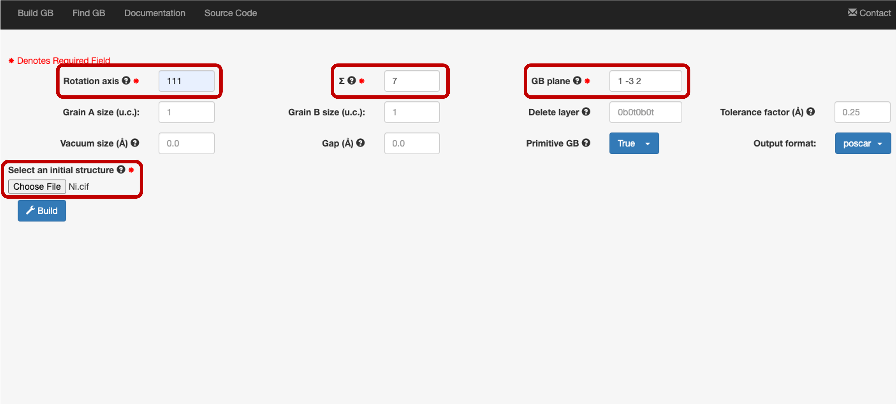
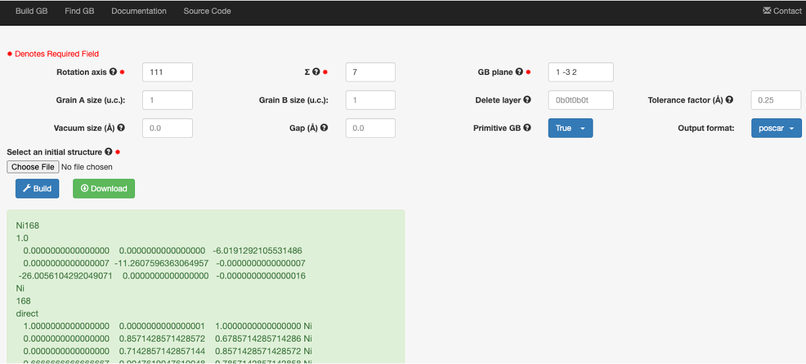

===============
FCC Ni
===============

Let's take Ni Σ7[111]/(1 -3 2) tilt grain boundary as an example. The initial structure is an `FCC lattice structure
<https://next-gen.materialsproject.org/materials/mp-23?chemsys=Ni>`_. Enter ``111`` for the **Rotation axis**, 
``7`` for the **Σ**, and ``1 -3 0`` for the **GB plane**, and upload an :download:`initial structure <images/Ni.cif>`.
Remember to add the space between the integers in ``1 -3 0``. The default output formate is ``poscar`` for VASP calculations.

Then click **Build**, you will see the following page. You can either copy & past the output or directly **Download** the file.

