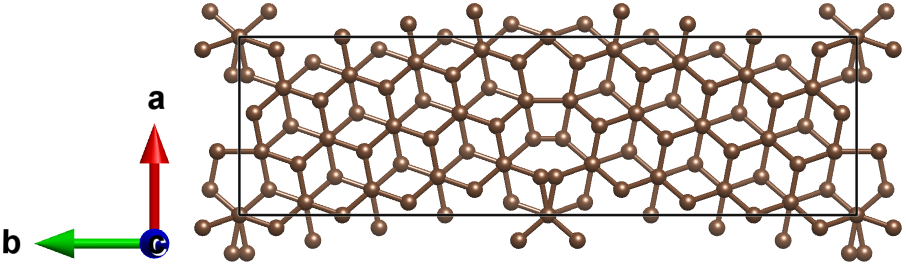
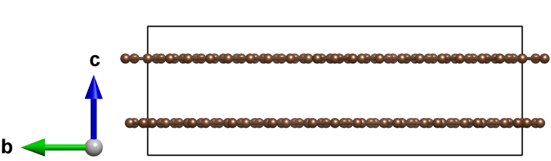
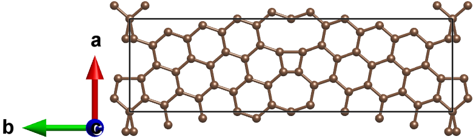

==================
Graphene 
==================

Let's take graphene Σ5[001]/(120) tilt grain boundary as an example. The initial structure can be found from `Materials Project
<https://next-gen.materialsproject.org/materials/mp-48?material_ids=mp-48>`_::

    from aimsgb import GrainBoundary, Grain

    s_input = Grain.from_file("POSCAR_C") 
    gb = GrainBoundary([0, 0, 1], 5, [1, 2, 0], s_input)
    structure = Grain.stack_grains(gb.grain_a, gb.grain_b, direction=gb.direction)

``s_input`` can also be created using ``from_mp_id`` method by giving an ``mp_id`` from `Materials Project <https://materialsproject.org/>`_. 
The ``mp_id`` of C is `mp-48`::

    s_input = Grain.from_mp_id("mp-48") 

The structure above has two layers of graphenes. To remove the top layer along the c-axis::

    structure.delete_bt_layer('t', direction=2)
    

Here, ``t`` means the top layer. ``direction`` is the direction to sort the sites by layers. 0: a, 1: b, 2: c