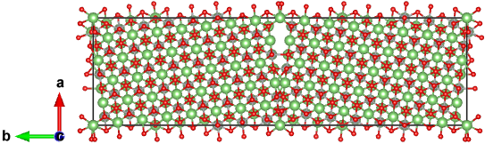

==================
LiNiO2
==================

Let's take LiNiO2 Σ13[001]/(230) tilt grain boundary as an example. The initial structure can be downloaded from this `Materials Project link
<https://next-gen.materialsproject.org/materials/mp-25411?formula=LiNiO2>`_::
    from aimsgb import GrainBoundary, Grain

    s_input = Grain.from_file("POSCAR_LiNiO2") 
    gb = GrainBoundary([0, 0, 1], 13, [2, 3, 0], s_input)
    structure = Grain.stack_grains(gb.grain_a, gb.grain_b, direction=gb.direction)

``s_input`` can also be created using ``from_mp_id`` method by giving an ``mp_id`` from `Materials Project <https://materialsproject.org/>`_. 
The ``mp_id`` of LiNiO2 is `mp-25411`::

    s_input = Grain.from_mp_id("mp-25411") 