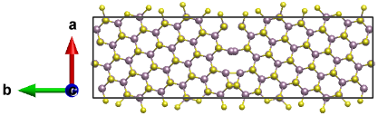
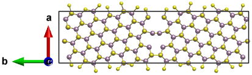

==================
MoS2 
==================

Let's take MoS2 Σ5[001]/(130) tilt grain boundary as an example. The initial structure can be downloaded from this `Materials Project link
<https://next-gen.materialsproject.org/materials/mp-2815?formula=MoS2>`_::

    from aimsgb import GrainBoundary, Grain

    s_input = Grain.from_file("POSCAR_MoS2") 
    gb = GrainBoundary([0, 0, 1], 5, [1, 3, 0], s_input)
    structure = Grain.stack_grains(gb.grain_a, gb.grain_b, direction=gb.direction)

``s_input`` can also be created using ``from_mp_id`` method by giving an ``mp_id`` from `Materials Project <https://materialsproject.org/>`_. 
The ``mp_id`` of MoS2 is `mp-2815`::

    s_input = Grain.from_mp_id("mp-2815") 

Notice that some atoms at the grain boundary sit too close to each other. Let's add 1 Å distance between the grains::

    structure = Grain.stack_grains(gb.grain_a, gb.grain_b, gap=1, direction=gb.direction)

