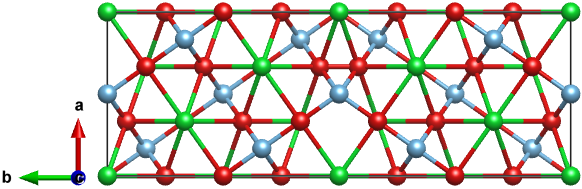
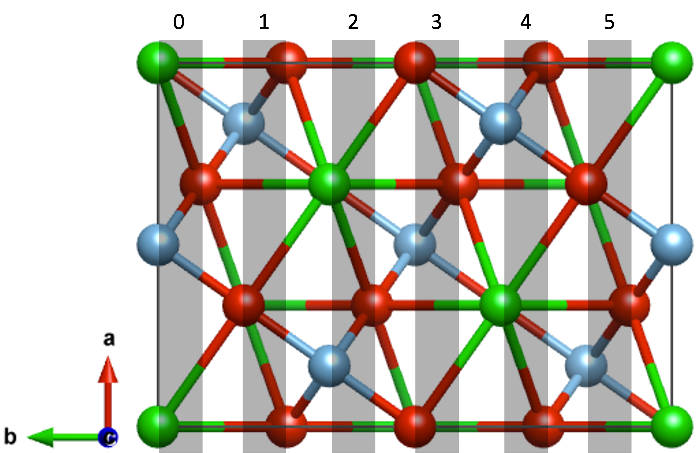

===============
SrTiO3
===============

Let's take SrTiO3 Σ3[110]/(1-12) tilt grain boundary as an example. The initial structure is a `cubic structure
<https://next-gen.materialsproject.org/materials/mp-5229?formula=SrTiO3>`_::
    
    from aimsgb import GrainBoundary, Grain

    s_input = Grain.from_file("POSCAR_SrTiO3") 
    gb = GrainBoundary([1, 1, 0], 3, [1, -1, 2], s_input)
    structure = Grain.stack_grains(gb.grain_a, gb.grain_b, direction=gb.direction)

``s_input`` can also be created using ``from_mp_id`` method by giving an ``mp_id`` from `Materials Project <https://materialsproject.org/>`_. 
The ``mp_id`` of a cubic SrTiO3 is `mp-5229`::

    s_input = Grain.from_mp_id("mp-5229") 

In VASP calculations of interface models, we often want to fix some layers in the bulk. ``aimsgb`` provides a method to fix some layers in each grain. 
First, let's check the number of layers in each grain::

    layers = gb.grain_a.sort_sites_in_layers(direction=gb.direction)
    print(len(layers))

We can see that there are 12 layers in each grain. Please note that the default tolerance factor to determnine if sites are in the same layer is 0.25 Angstrom.
You can change the tolerance factor by giving a ``tol`` argument::

    layers = gb.grain_a.sort_sites_in_layers(direction=gb.direction, tol=1)
    print(len(layers))

We can see that there are 6 layers in each grain. 

