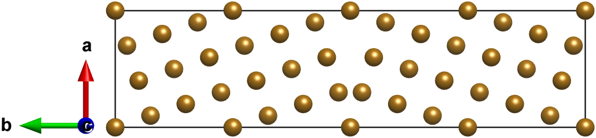

===============
Basic Usage
===============

Let's take Fe Σ5[001]/(120) tilt grain boundary as an example. The initial structure is a BCC lattice structure.::

    from aimsgb import GrainBoundary, Grain

    s = Grain.from_file("POSCAR_Fe") 
    gb = GrainBoundary([0, 0, 1], 5, [1, 2, 0], s)
    structure = gb.build_gb()

To construct a bigger supercell for each grain, say 2 unit cells::

    gb = GrainBoundary([0, 0, 1], 5, [1, 2, 0], s, uc_a=2, uc_b=2)
    structure = gb.build_gb()

To construct a Fe Σ5[001]/(001) twist grain boundary::

    gb = GrainBoundary([0, 0, 1], 5, [0, 0, 1], s)
    structure = gb.build_gb()

